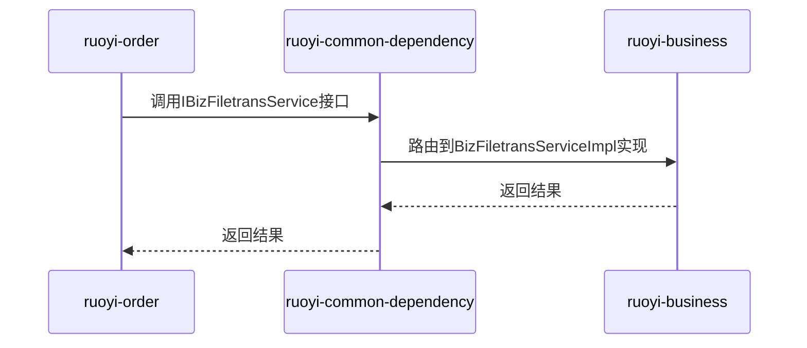
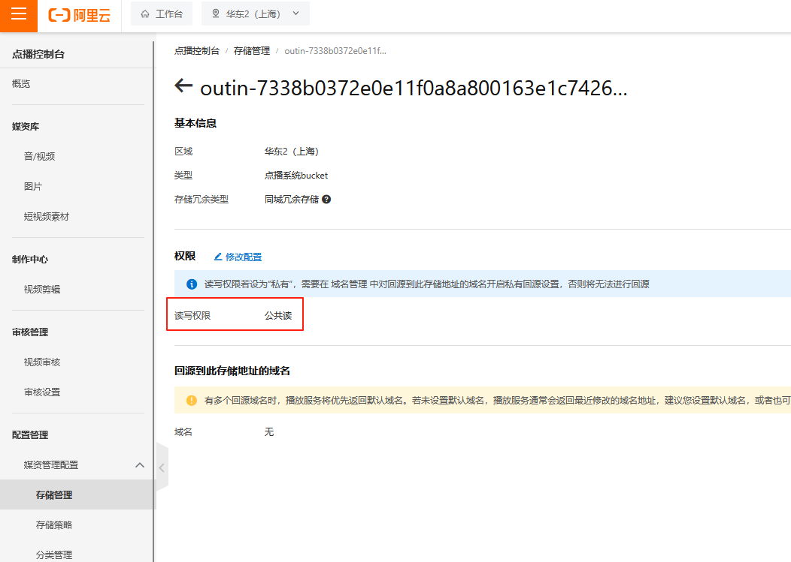
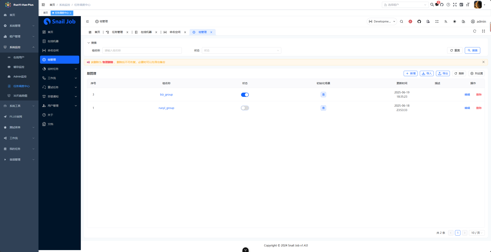
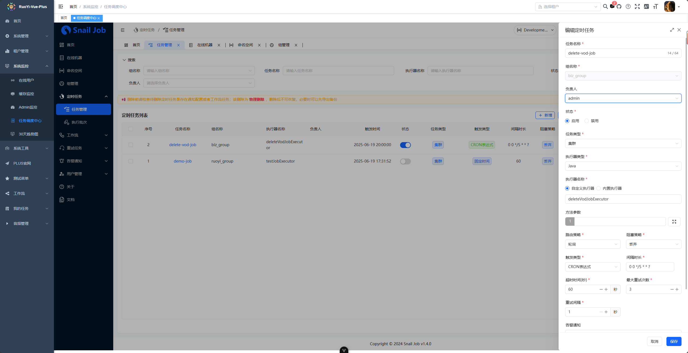

# 目录

## 10-2 在阿里云智能语音交互服务中设置支持识别多国语言.mp4

### [阿里云-智能语音交互](https://nls-portal.console.aliyun.com/overview)

首次打开页面会提示，开通

#### 创建项目

路径：全部项目 -》 创建项目 -》 项目名称（中文） -》 其他默认

## [关于登录调试步骤](https://plus-doc.dromara.org/#/questions/login_step?id=%e5%85%b3%e4%ba%8e%e7%99%bb%e5%bd%95%e8%b0%83%e8%af%95%e6%ad%a5%e9%aa%a4)

### 1. 关闭 api 接口加密 （方便查看F12的请求参数）

#### 1.1 后端

修改后端配置文件 application.yml

```yaml
# api接口加密
api-decrypt:
  # 是否开启全局接口加密
  #enabled: true
  enabled: false  ## 设置 false
## ... 
```

#### 1.2 前端

修改前端配置文件 .env.development | .env.production

```text
# 接口加密功能开关(如需关闭 后端也必须对应关闭)
VITE_APP_ENCRYPT = true
```

### 1.3 屏蔽登录验证码

src/main/resources/application.yml

```yaml
captcha:
#  enable: true
  enable: false  ## 设置 false
## ... 
```

### 2. 登录参数

#### 2.1 对照表
```text
参数名 	说明
tenantId 	租户id
username 	用户名
password 	密码
rememberMe 	记住密码
uuid 	-
code 	验证码结果
clientId 	客户端id（表 sys_client）
grantType 	授权类型（表 sys_client）
```

### 2.2 上述已经屏蔽验证码，`故此缺少 code`

```json
{
    "tenantId": "000000",
    "username": "admin",
    "password": "admin123",
    "rememberMe": true,
    "clientId": "e5cd7e4891bf95d1d19206ce24a7b32e",
    // "code": "12",
    "grantType": "password"
}
```

### 2.3 没有屏蔽验证码，也没有传入会提示下面错误

```json
{
    "code": 403,
    "msg": "没有访问权限，请联系管理员授权",
    "data": null
}
```

## feat(order): 11.9 下单成功后跳转到支付宝支付页面

#### 控制返回二维码, 还是支付页面配置

org.dromara.order.alipay.impl.AliPayServiceImpl

- `"qr_pay_mode", "4"`, 强制使用扫码支付
- `aliPayProperties.getReturnUrl()` 支付完成后，指定返回的页面

```java
@Override
public AlipayTradePagePayResponse pay(String subject, String outTradeNo, String totalAmount) {
    log.info("调用支付宝下单接口开始，subject：{}，outTradeNo：{}，totalAmount：{}", subject, outTradeNo, totalAmount);
    // 1. 设置参数（全局只需设置一次）
    Factory.setOptions(getOptions());
    try {
        // 2. 发起API调用（以创建网站支付为例）
//            AlipayTradePagePayResponse response = Factory.Payment.Page()
//                .optional("qr_pay_mode", "4")  // 如果指定了就会, 强制使用扫码支付, 不会出现支付页面
//                .pay(subject, outTradeNo, totalAmount, aliPayProperties.getReturnUrl()); // 支付完成后，指定返回的页面，自己定义的
        AlipayTradePagePayResponse response = Factory.Payment.Page()
            .pay(subject, outTradeNo, totalAmount, null);
        // 3. 处理响应或异常
        if (ResponseChecker.success(response)) {
            log.info("调用支付宝下单接口成功，结果：{}", JSON.toJSONString(response));
            return response;
        } else {
            log.warn("调用支付宝下单接口失败，原因：{}", JSON.toJSONString(response));
            throw new ServiceException(BusinessExceptionEnum.ALIPAY_ERROR.getDesc());
        }
    } catch (Exception e) {
        log.error("调用支付宝下单接口异常，原因：", e);
        throw new ServiceException(BusinessExceptionEnum.ALIPAY_ERROR.getDesc());
    }
}
```

### 甲蛙内网穿透在线工具（不需要安装，只需要注册即可）

* [甲蛙内网穿透在线工具](http://callback.jiawablog.com/)
* 登录 > 配置
  * 复制：（回调地址，将该地址配置到你的项目中） http://callback.jiawablog.com/callback/582762149093445632 填入配置里面
  * 输入：本地回调地址
* 浏览器
  * Chrome浏览器需要改配置, 输入：`chrome://flags` 页面来启用或禁用“block insecure private network requests”功能
  * Firefox浏览器需要改配置, 输入：`about:config` 
    * 在搜索栏输入以下参数：
      * `network.http.referer.disallowCrossSiteRelaxingDefault`   true 改为 false
      * `security.mixed_content.block_active_content`   值为 false
      * `network.cors_preflight.allow_private_network_access`    布尔 == true


### 项目存在循环依赖问题, [ruoyi-order](ruoyi-modules/ruoyi-order) 与 [ruoyi-business](ruoyi-modules/ruoyi-business)

#### 思路图



`mermaid图需要安装插件`


#### 解决循环依赖的方案

在 ruoyi-common-dependency 中定义共享的 API 接口和实体类，将两个模块之间的依赖关系提取到公共模块中，从而达到`完全解耦`,`可维护性`

##### 具体步骤：

###### 1. 创建共享模块

(1). 在 ruoyi-common-dependency 中创建共享包结构：

```text
com.ruoyi.common.dependency
├── order
│   ├── api
│   │    └──  IOrderInfoService
│   └── domain
│   └── enums
└── business
    ├── api
    │    └──  IBizFiletransService
    └── domain
```

`将原来 ruoyi-order 和 ruoyi-business 的实体、枚举、IOrderInfoService业务接口、IBizFiletransService业务接口迁移到 ruoyi-common-dependency, 其余没有循环调用的业务层依旧存放在原来的目录里面`

##### 2. 修改模块依赖

(1). ruoyi-order 的 pom.xml:

```xml
<dependency>
    <groupId>com.ruoyi</groupId>
    <artifactId>ruoyi-common-dependency</artifactId>
</dependency>
    <!-- 移除对 ruoyi-order 的直接依赖 -->
```

(2). ruoyi-business 的 pom.xml:

```xml
<dependency>
    <groupId>com.ruoyi</groupId>
    <artifactId>ruoyi-common-dependency</artifactId>
</dependency>
<!-- 移除对 ruoyi-business 的直接依赖 -->
```

##### 3. 修改代码实现

举例：修改 AfterPayServiceImpl、BizFiletransServiceImpl 的包引入路径：

```java
//# AfterPayServiceImpl
import com.ruoyi.common.dependency.api.business.IBizFiletransService;

//# BizFiletransServiceImpl
import com.ruoyi.common.dependency.api.business.IBizFiletransService;
```

`当然, 还有BO、VO、Enums等的引用需要修改路径, 不再一一描述`

##### 4. 自动配置类

(1) org/dromara/order/config/OrderAutoConfiguration.java

```java
@AutoConfiguration
@ConditionalOnClass(IOrderInfoService.class)
public class OrderAutoConfiguration {

    // 根据 OrderInfoServiceImpl 引用而添加
    private final OrderInfoMapper orderInfoMapper;
    private final IAliPayService aliPayService;

    public OrderAutoConfiguration(OrderInfoMapper orderInfoMapper, IAliPayService aliPayService) {
        this.orderInfoMapper = orderInfoMapper;
        this.aliPayService = aliPayService;
    }

    @Bean
    @ConditionalOnMissingBean
    public IOrderInfoService orderInfoService() {
        return new OrderInfoServiceImpl(orderInfoMapper, aliPayService);
    }
}
```

(2) org/dromara/business/config/BusinessAutoConfiguration.java

```java
@AutoConfiguration
@ConditionalOnClass(IBizFiletransService.class)
public class BusinessAutoConfiguration {

    // 根据 BizFiletransServiceImpl 引用而添加
    private final BizFiletransMapper filetransMapper;
    private final IOrderInfoService orderInfoService;

    public BusinessAutoConfiguration(BizFiletransMapper filetransMapper, IOrderInfoService orderInfoService) {
        this.filetransMapper = filetransMapper;
        this.orderInfoService = orderInfoService;
    }

    @Bean
    @ConditionalOnMissingBean
    public IBizFiletransService filetransService() {
        return new BizFiletransServiceImpl(filetransMapper, orderInfoService);
    }
}
```


###### 4.1 自动装配

```text
src/
└── main/
    └── resources/
        └── META-INF/
            ├── spring.factories               # Spring Boot < 2.7
            └── spring/
                └── org.springframework.boot.autoconfigure.AutoConfiguration.imports # Spring Boot ≥ 2.7
```

现有springboot版本3.4.4, 故此使用如下：

```text
# [ruoyi-business](ruoyi-modules/ruoyi-business)
# src/main/resources/META-INF/spring/org.springframework.boot.autoconfigure.AutoConfiguration.imports
org.dromara.business.config.BusinessAutoConfiguration

# [ruoyi-order](ruoyi-modules/ruoyi-order)
# src/main/resources/META-INF/spring/org.springframework.boot.autoconfigure.AutoConfiguration.imports
org.dromara.order.config.OrderAutoConfiguration
```

### refactor(order): 11.16 支付成功后修改订单状态和语音识别状态

- 修改支付宝回调通知的处理逻辑，增加支付成功后的后续处理
- 优化日志输出格式，提高日志可读性 （调正跟踪ID位置）
- 更新配置文件，调整支付成功后的跳转页面
- 支付状态流程简述：
  - 在客户扫码支付后，页面会停留，一直请求后台查询支付状态
  - 通过`甲蛙内网穿透在线工具`会多出一条数据, 手动请求本地, 后台会根据 `/alipay/callback` 接口修改 order_info 表的状态 I > S
    - （为什么不会自动完成？ 因为alipay.notifyUrl这个配置设置了甲蛙的地址为通知URL）
  - 然后Web项目页面就会自动退出支付模态框, 停止后台查询支付状态

### feat(nls): 12.2 添加智能语音交互（NLS）功能

- 新增 NlsFiletransProperties 配置类，用于阿里云智能语音服务文件传输属性配置
- 添加 NlsUtil 工具类，实现录音文件识别和结果查询功能
- 在 ruoyi-common 中引入 nls 模块，并更新相关依赖
- 在 ruoyi-business 中添加对 nls 模块的使用 （支付成功后处理，发起语音识别任务）
- 优化 ruoyi-order 中的支付流程，支持全链路查询，在异步通知没收到的情况下，可以通过方法查询获取支付结果

#### 解决循环依赖问题

##### 本次出现依赖问题的类

```text
webBizFiletransController （不需要改动）
    ↓
bizFiletransServiceImpl  （不需要改动）
    ↓
orderInfoServiceImpl  (为循环依赖改动)
    ↓
afterPayServiceImpl   (为循环依赖改动)
    ↑
    └── bizFiletransServiceImpl (需要闭环)
```

问题根源在于：
1. bizFiletransServiceImpl 依赖 orderInfoServiceImpl
2. orderInfoServiceImpl 依赖 afterPayServiceImpl
3. afterPayServiceImpl 又依赖 bizFiletransServiceImpl

##### 修改 OrderInfoServiceImpl

```java
@Slf4j
@RequiredArgsConstructor
@Service
public class OrderInfoServiceImpl implements IOrderInfoService {

    private final OrderInfoMapper baseMapper;
    private final IAliPayService aliPayService;

    // 移除外部的 @Autowired，改为 setter 注入
    private IAfterPayService afterPayService;

    @Autowired
    public void setAfterPayService(IAfterPayService afterPayService) {
        this.afterPayService = afterPayService;
    }
    // ... 其他代码不变 ...
}
```

##### 修改 AfterPayServiceImpl

```java
@Slf4j
@Service
public class AfterPayServiceImpl implements IAfterPayService, ApplicationContextAware {

    private ApplicationContext applicationContext;

    @Resource
    private IOrderInfoService orderInfoService;

    // 移除外部的 @Resource，改为延迟获取
//    @Resource
//    private IBizFiletransService filetransService;

    @Override
    public void setApplicationContext(@NotNull ApplicationContext applicationContext) throws BeansException {
        this.applicationContext = applicationContext;
    }

    // 延迟获取 filetransService
    private IBizFiletransService getFiletransService() {
        return applicationContext.getBean(IBizFiletransService.class);
    }

    /**
     * 支付成功后的处理方法
     * 在订单支付成功后，更新订单状态和相关记录
     *
     * @param orderNo     订单号
     * @param channelTime 渠道时间
     */
    @Transactional
    @Override
    public void afterPaySuccess(String orderNo, Date channelTime) {
        // 记录支付成功处理开始日志
        log.info("执行支付成功动作开始");

        // 校验订单是否存在
        OrderInfo orderInfo = orderInfoService.selectByOrderNo(orderNo);
        if (orderInfo.equals(new OrderInfo())) {
            // 如果订单不存在，记录错误日志并返回
            log.error("订单不存在，{}", orderNo);
            return;
        }

        // 将订单更新成S
        log.info("更新订单信息开始");
        int i = orderInfoService.afterPaySuccess(orderNo, channelTime);
        if (i == 0) {
            // 如果订单状态不是初始状态，记录错误日志并返回
            log.error("订单状态异常，订单状态非初始，{}，结束", orderNo);
            return;
        }

        // 根据订单类型进行后续处理
        if (orderInfo.getOrderType().equals(OrderInfoOrderTypeEnum.FILETRANS_PAY.getCode())) {
            // 如果是语音识别单次付费订单，将语音识别记录更新成SI
            log.info("语音识别单次付费，更新语音识别表状态");

            String info = orderInfo.getInfo();
            Map<String, Object> infoMap = JsonUtils.parseObject(info, Map.class);
            String idStr = (String) infoMap.get("id"); // 注意类型是否为 String
            Long filetransId = Long.valueOf(idStr);

            // 使用延迟获取的方式， 屏蔽 filetransService.afterPaySuccess(filetransId);
            getFiletransService().afterPaySuccess(filetransId);
        }

        // 记录支付成功处理结束日志
        log.info("执行支付成功动作结束");
    }
}
```

##### springboot <=2.6 以下版本可用

实测, 必需添加，不然会启动报错提示：`orderInfoServiceImpl与afterPayServiceImpl互相依赖，Relying upon circular references is discouraged and they are prohibited by default. Update your application to remove the dependency cycle between beans. As a last resort, it may be possible to break the cycle automatically by setting spring.main.allow-circular-references to true.
`, 但是就添加此配置也无法解决，需要配合上述的双重延迟加载

```yaml
--- # 打破循环依赖引入
spring:
  main:
    allow-circular-references: true
```

##### 关键修改说明

（1）完全移除字段注入：
* 移除了 AfterPayServiceImpl 中的 @Resource private IBizFiletransService filetransService
* 为通过 ApplicationContext 延迟获取 IBizFiletransService

（2）双重延迟加载：
* 同时延迟加载 IOrderInfoService 和 IBizFiletransService
* 通过 getOrderInfoService() 和 getFiletransService() 方法在需要时获取 Bean

（3）保持业务逻辑不变：
* 所有业务逻辑保持不变，只是改变了依赖获取方式
* 延迟加载确保在 Bean 初始化完成后才获取依赖


##### 回调使用工具

[智能语音交互文档](https://help.aliyun.com/zh/isi/developer-reference/use-function-compute-to-recognize-recording-files)

###### [甲蛙接口回调](http://callback.jiawablog.com/index)

* old addr：本地回调地址：http://127.0.0.1:8080/alipay/callback
* new addr：本地回调地址：http://127.0.0.1:8080/nls/filetrans/callback

###### Ngrok

[教你用ngrok实现内网穿透](https://blog.csdn.net/2301_79728896/article/details/145519092)

注册与登录：https://dashboard.ngrok.com/get-started/setup/windows

按上面文档可配置固定的域名，然后下载对应系统的软件

双击图标：ngrok http --url=narwhal-alert-sincerely.ngrok-free.app 8080 --region=jp

## 错误记录

1、报错信息：{TaskId：xxxxxxxxxx，StatusCode：41050025，StatusText：FILE_403_FORBIDDEN}

视频点播服务这个系统bucket是私有，直接访问的话，得改成公共读



## 15.2 删除过期的VOD视频，释放多余的空间

### SnailJob 调度中心

两种方式：
1. 浏览器：http://localhost:8800/snail-job
2. 登录本系统 -> 系统监控 -> 任务调度中心

* 初始账号：admin
* 初始密码：admin

#### 1. 参考文档

* [SnailJob 官方文档](https://snailjob.opensnail.com/docs/guide/job/job_executor.html)
* [RuoYi-Plus 搭建SnailJob任务调度中心(5.2.0新功能)](https://plus-doc.dromara.org/#/ruoyi-vue-plus/quickstart/snail_job_init)

#### 2. SnailJob配置说明

ruoyi-admin\src\main\resources\application-dev.yml

```yaml
--- # snail-job 配置
snail-job:
  enabled: true
  # 需要在 SnailJob 后台组管理创建对应名称的组,然后创建任务的时候选择对应的组,才能正确分派任务
  group: "biz_group"
  # SnailJob 接入验证令牌 详见 script/sql/ry_job.sql `sj_group_config` 表
  token: "SJ_VqRxrYvNqLpc4P2bXh5cuVdbU3hLfNv8"
  server:
    host: 127.0.0.1
    port: 17888
  # 命名空间UUID 详见 script/sql/ry_job.sql `sj_namespace`表`unique_id`字段
  namespace: ${spring.profiles.active}
  # 随主应用端口漂移
  port: 2${server.port}
  # 客户端ip指定
  host:
  # RPC类型: netty, grpc
  rpc-type: grpc
```

`group、token 的参数在SnailJob Web端获取`



ruoyi-extend\ruoyi-snailjob-server\src\main\resources\application-dev.yml

```yaml
spring:
  datasource:
    type: com.zaxxer.hikari.HikariDataSource
    driver-class-name: com.mysql.cj.jdbc.Driver
    url: jdbc:mysql://192.168.56.101:3306/ry-job?useUnicode=true&characterEncoding=utf8&zeroDateTimeBehavior=convertToNull&useSSL=true&serverTimezone=GMT%2B8&autoReconnect=true&rewriteBatchedStatements=true&allowPublicKeyRetrieval=true&nullCatalogMeansCurrent=true
    username: root
    password: root
    hikari:
      connection-timeout: 30000
      validation-timeout: 5000
      minimum-idle: 10
      maximum-pool-size: 20
      idle-timeout: 600000
      max-lifetime: 900000
      keepaliveTime: 30000
```

`配置数据库, 对应 script/sql/ry_job.sql`

#### 2. SnailJob主要在那个模块使用

ruoyi-vue-avocation\ruoyi-modules\ruoyi-job\src\main\java\org\dromara\job\snailjob\DeleteVodJobExecutor

```java
@Slf4j
@Component
@JobExecutor(name = "deleteVodJobExecutor")
public class DeleteVodJobExecutor {

    @Resource
    private IBizFiletransService filetransService;

    public ExecuteResult jobExecute(JobArgs jobArgs) {
//        SnailJobLog.LOCAL.info("deleteVodJobExecutor. jobArgs:{}", JsonUtil.toJsonString(jobArgs));
//        SnailJobLog.REMOTE.info("deleteVodJobExecutor. jobArgs:{}", JsonUtil.toJsonString(jobArgs));
        try {
            // 增加日志流水号
            MDC.put("LOG_ID", IdUtil.getSnowflakeNextIdStr());
            log.info("删除VOD跑批开始");
            long start = System.currentTimeMillis();
            // 删除早期视频
            filetransService.deleteVodJob();
            log.info("删除VOD跑批结束，耗时：{}毫秒", System.currentTimeMillis() - start);
            MDC.clear();
        } catch (Exception e) {
            log.error("删除VOD跑批异常", e);
        }
        return ExecuteResult.success("删除早期视频");
    }
}
```

```text
引入需要执行的页面
jobArgs 可以获取到Web页面传来的固定参数, 可以是json
@JobExecutor(name = "deleteVodJobExecutor")  是执行器名称, 对应页面执行器名称输入, 是必填项
```



