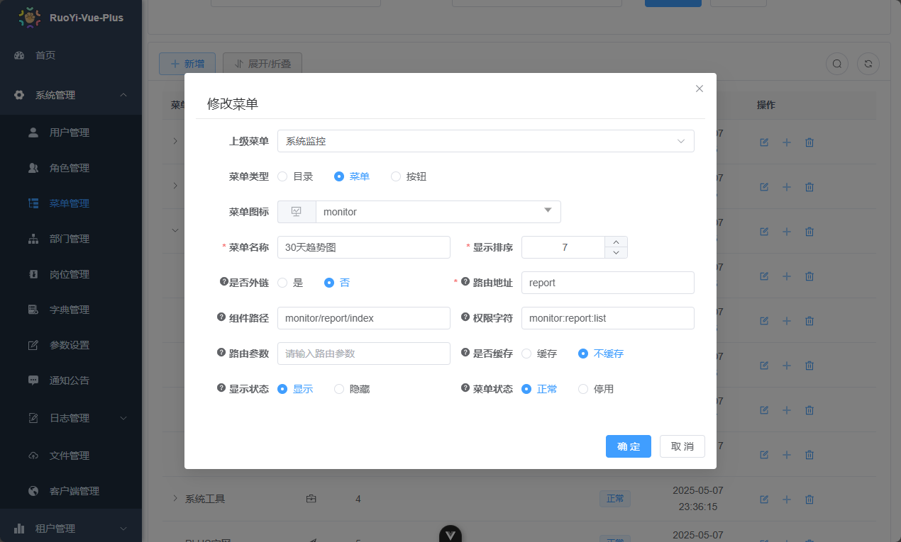

# 前端

## 9-9 前端集成vod sdk实现文件上传

### [使用JavaScript SDK上传文件](https://help.aliyun.com/zh/vod/developer-reference/upload-sdk-for-javascript?spm=a2c4g.11186623.help-menu-29932.d_4_1_6_1_1.3a6b485cEgJijk#34b59711afp0q)

* [下载SDK代码：V1.5.6 JavaScript上传SDK](https://alivc-demo-cms.alicdn.com/versionProduct/sourceCode/upload/JS/aliyun-upload-sdk-1.5.6.zip?spm=a2c4g.11186623.0.0.75604c7eagoFQg&file=aliyun-upload-sdk-1.5.6.zip)
* 使用安装命令：npm install aliyun-upload-sdk


| 特性                 | 直接复制 SDK 文件                          | 使用 npm install aliyun-upload-sdk          |
|----------------------|-------------------------------------------|---------------------------------------------|
| 引入方式             | 通过 `<script>` 标签引入                  | 通过 `import` 引入                          |
| 依赖管理             | 手动管理文件，容易遗漏或版本不一致        | 通过 `package.json` 管理，版本一致          |
| 构建工具支持         | 需要手动配置构建工具（如 Vite/Webpack）   | 自动支持，无需额外配置                      |
| 代码提示和类型检查   | 无代码提示和类型检查                      | 支持代码提示和类型检查（如果有类型定义）    |
| 适用场景             | 简单项目或快速原型开发                    | 现代前端项目，尤其是使用 TypeScript 的项目  |

`总结: 直接复制 SDK 文件：适合简单项目, 如果项目较复杂或使用 TypeScript，推荐使用 npm install aliyun-upload-sdk。`


暂时项目使用直接复制SDK方式
1. 下载 aliyun-upload-sdk.js 并放入 public/js 目录：
```text
/public
  /js
    /aliyun-oss-sdk-6.17.1.min.js
    /aliyun-upload-sdk-1.5.6.min.js
```
2. 在根目录下 index.html 中引入：
```text
<html>
  <head>
      <script src="/js/aliyun-oss-sdk-6.17.1.min.js"></script>
      <script src="/js/aliyun-upload-sdk-1.5.6.min.js"></script>
      <script src="/js/es6-promise.min.js"></script>
  </head>
</html>
```

### 目录结构说明 （截止到 9.9）

```text
plus-ui-ts
│
│ index.html ## 通过这里引入阿里云Vod.SDK
├─public
│  │  favicon.ico
│  │  
│  └─js  ## 阿里云Vod.SDK
│          aliyun-oss-sdk-6.17.1.min.js
│          aliyun-upload-sdk-1.5.6.min.js
│          es6-promise.min.js
├─src
│  │  
│  ├─components ## 组件目录
│  │  ├─Alibaba
│  │  │  └─Vod
│  │  │          FileUploader.vue ## 所以关于文件上传、阿里云SDK调用、请求后端API接口的逻辑
│  │  │
│  ├─api ## 调用后端API目录
│  │  │  
│  │  ├─audio
│  │  │  └─voiceRecognition
│  │  │          filetrans-upload.ts ## 请求API地址：/web/vod/get-upload-auth
│  │  │          types.ts ## 实体参数
│  │  │
│  └─views ## 展示页面
│      │  
│      ├─audio
│      │  └─voiceRecognition
│      │          filetrans-upload.vue  ## 点击按钮后文件弹框的实现, 里面调用 FileUploader.vue组件
│      │          index.vue  ## 语音识别的主窗口
```

`按照上面调用顺序： views ==> components ==> api`


### feat(audio): 9.10 优化文件上传组件并添加上传文件进度条

- 重构 FileUploader 组件，增加上传状态和进度显示
- 新增 FileTrans 和 FileUploaderExpose 接口，用于定义上传状态和暴露的方法
- 更新 filetrans-upload组件，集成新的上传状态显示功能
- 优化文件上传逻辑，支持上传进度实时更新

### feat(order): 11.9 下单成功后跳转到支付宝支付页面

#### 下单成功后，添加一段JS代码 （代码段可以复制到其他前端，只要支持JS环境）

```js
// 处理支付宝返回的表单
let divForm = document.getElementsByTagName('divform');
if (divForm.length) {
  document.body.removeChild(divForm[0])
}
const div = document.createElement('divform');
// 支付宝返回的form
div.innerHTML = response.msg;
document.body.appendChild(div);
document.forms[0].setAttribute('target', '_blank');
document.forms[0].submit();
```

### feat(audio): 11.12 增加支付宝扫码组件, 下单后弹出支付宝二维码对话框

#### [alipay-com.vue组件说明](src/components/Alibaba/OrderInfo/alipay-com.vue)

`包含二维码的显示、订单的定时查询、支付结果事件等小功能, 以后如果也有这样需求的支付方式，可以微调后复用到别的项目里`


### feat(monitor): 14.13 新增30天趋势图模块

#### 先在菜单里面创建模块 - 30天趋势图



#### 创建文件

展示页面 ruoyi-vue/src/views/monitor/report/index.vue

API ruoyi-vue/src/api/monitor/report/index.ts

实体与接口 ruoyi-vue/src/api/monitor/report/types.ts

`按上面说的去做，就可以新建一个新的模块`


### feat(monitor): 14.14 趋势图开发，Apache Echarts图表库使用

[Apache ECharts 一个基于 JavaScript 的开源可视化图表库](https://echarts.apache.org/zh/index.html)